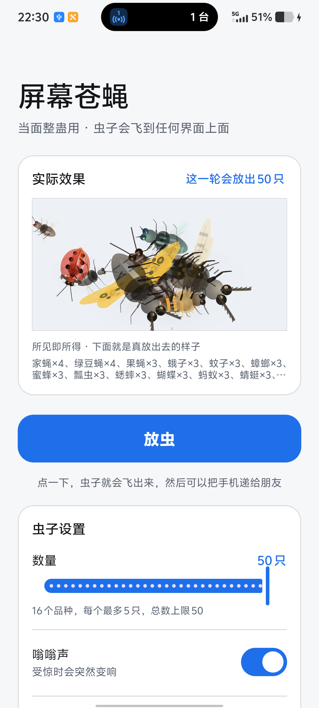

# 屏幕虫子 · Screen Bugs

一个安卓恶搞小工具：点一下，屏幕上就放出虫子。

它**不只是一个界面里的小动画** —— 虫子会飞出 App，爬到你的桌面、微信、任何界面上面。
用手指去戳，它会躲开、弹走、震一下、嗡的一声变响。就是那种你打不着、又赶不走的烦人东西。

**16 个品种，全部用 Canvas 手绘，没有任何图片素材。** 会飞的、会爬的、会跳的、会悬停的，
还有几种**根本没有翅膀**。

<p align="center">
  
</p>

> 仅供当面整蛊朋友。不联网、不读其他应用内容、退出入口一直在通知栏。

---

## 它长什么样

16 个品种，分四类运动方式 + 两类特殊形态：

| 品种 | 体型 | 外观特征 | 运动方式 |
|---|---|---|---|
| **家蝇** | 1.0× | 灰黑身体、红褐复眼、短触角带芒 | 飞：飘忽巡航 + 突然窜逃 |
| **绿豆蝇** | 1.25× | 绿色金属光泽、青蓝复眼 | 飞：更快更凶 |
| **果蝇** | 0.62× | 小巧黄褐 | 飞：又快又碎，几乎不停 |
| **蛾子** | 2.05× | 肥硕、**背毛**、宽圆翅带波纹、羽状触角 | 悬停：慢飘，爱趴着 |
| **蚊子** | 0.82× | 细长身体、极细长腿、长触角 | 飞：52Hz 高频扇翅 |
| **蟑螂** | 1.7× | 扁平油亮、**前胸两条纵纹**、超长触角 | 爬：极快，几乎不飞 |
| **蜜蜂** | 1.15× | **金褐绒毛胸** + 腹部 3 条黄带 | 悬停：55Hz 扇翅 |
| **瓢虫** | 1.0× | **椭圆壳（宽长比 0.77）**、7 枚黑斑、前胸 2 白斑 | 爬：圆壳，中等速度 |
| **蟋蟀** | 1.35× | **粗大后腿**、前胸 5 斑、复眼间深色横带 | 爬+跳：平时慢爬，突然弹跳 |
| **蝴蝶** | 1.95× | 黄色翅膀带黑斑、**四翅（前后翅）** | 悬停：慢扇翅，爱停 |
| **蚂蚁** | 0.7× | 三节身体、**肘状触角**、极细腿 | 爬：快，走直线 |
| **蜻蜓** | 1.8× | **四片长翅**、复眼极大且背面相接、细腿 | 悬停：空中停住不动 |
| **臭虫** | 0.95× | **无翅**、宽扁椭圆、**前胸向两侧扩张成臂** | 爬：慢，几乎一直趴着 |
| **虱子** | 0.6× | **无翅**、细长分节、**腹部边缘暗黑** | 爬：很慢 |
| **衣鱼** | 1.05× | **无翅**、泪滴形、银色鳞片、**三根长尾须** | 爬：中等，会窜 |
| **跳蚤** | 0.75× | **侧扁**（俯视 3:1 窄长条）、**两排向后指的刺梳**、黑色单眼 | 爬+跳：弹跳感最强 |

---

## 三个技术上有意思的地方

### 1. 触摸穿透：怎么做到「隐形但不吃触摸」

这是这类 App 最容易做崩的地方。

虫子要在别的 App 上面画，悬浮窗就必须加 `FLAG_NOT_TOUCHABLE`，
否则你的隐形全屏窗口会**吃掉整块屏幕的触摸**，朋友的手机就完全点不动了。

但加了 `NOT_TOUCHABLE` 之后，窗口再也收不到触摸事件，
也就没法知道"用户戳到虫子了没有"。

**解法是双窗口**：

| 窗口 | 尺寸 | 作用 |
|---|---|---|
| 绘制层 | 全屏 | 只负责画，`FLAG_NOT_TOUCHABLE`，不吃触摸 |
| 触摸替身 | 只有虫子那么大 | 罩在虫子身上，专门用来吃触摸 |

戳到虫子 → 被小窗口吃掉 → 虫子弹走 + 震动 + 嗡声变响
戳在别处 → 小窗口根本不在那儿 → 触摸照常传给下面的 App

虫子多时（最多 50 只）会用 **6 个替身**分摊到不同虫子身上，
让屏幕各处都有能戳中的虫子 —— 虫子数量再多，窗口数也固定在 7 个以内。

### 2. 用真实照片数据校正模型，而不是凭感觉画

因为没法"看一眼照片照着画"，所以走了两条可量化的路：

**① 从分类学文献提取解剖测量值** —— 这直接暴露了一堆凭印象画出来的错误：

| 原来的画法 | 真实数据 |
|---|---|
| 蜜蜂：黄底黑纹 | **深色腹 + 3 条黄带在腹节前缘**（方向完全反了） |
| 瓢虫：圆形，3 个随机点 | 宽长比 **0.77 椭圆**；**7 斑 = 每鞘翅 3 + 盾片斑跨中缝** |
| 蟑螂：无条纹，L:W ~1.7 | **前胸两条纵纹贯穿全长**；**L:W 2.6:1** |

**② 从照片像素程序化提取轮廓** —— `tools/compare-silhouette.ps1` 把任意真实昆虫照片
的背面轮廓提取成「归一化宽度剖面」，和模型逐点对比，**用数字找比例偏差**：

```
 70% 0.995  ########################################   ← 最宽处
 95% 0.374  ###############                            ← 收窄
  0% 0.080  ###                                        ← 头部
```

### 3. 振动反馈：分事件 / 分品种 / 分体型

不是"振一下就完了"：被戳中、逃窜、跳跃、落地、起飞各有不同的振感组合，
强度按品种缩放 —— **果蝇 48 和蟑螂 135 差了近 3 倍**。

同时有三条克制原则，否则 50 只虫子会让手机变成按摩器：

- 只报有意义的**瞬间**，不是每帧
- 虫群的自然事件**只在靠近触摸替身时才振**（未加时每秒振 3~4 次，加了降到 0.9 次/秒）
- 90ms 限流兜底

并且**尊重系统设置**：系统关掉「触感反馈」、开了勿扰、或设备无振动器时，完全不振。

---

## 实测数据

在 **vivo / Android 16 (API 36) / 1260×2800 @560dpi** 上实测：

| 虫子数量 | 帧时间 p50 | p90 | p99 | Janky frames | Missed Vsync |
|---|---|---|---|---|---|
| 1 只 | 9 ms | 10 ms | 11 ms | 0 | 0 |
| 14 只 | 22 ms | 25 ms | 28 ms | 0 | 0 |
| **50 只（满）** | **30 ms** | 34 ms | 38 ms | **0** | **0** |

- 覆盖层窗口数**恒定 7 个**（1 绘制层 + 6 触摸替身），不随虫子数量增长
- 唤醒锁正确获取与释放，收网后无残留
- 触摸穿透与戳中反应均验证通过（10 次点击 9 次命中）

---

## 编译和安装

### 需要什么

- Windows + PowerShell 5.1（或 7）
- 约 600MB 磁盘空间
- 一条**能传数据**的 USB 线（很多线只能充电，这是最常见的坑）

脚本会自动装好 JDK 17 + Gradle 8.9 + Android SDK 35 到 `D:\Android`，
**不动你系统里已有的 Java**（安卓构建目前用不了 Java 25）。下载走国内镜像加速。

```powershell
# 1. 装环境（约 600MB，走华为云镜像）
powershell -ExecutionPolicy Bypass -File tools\setup-android-env.ps1

# 2. 编译出 APK
powershell -ExecutionPolicy Bypass -File tools\build-apk.ps1

# 3. 手机插数据线，安装并自动放出虫子
powershell -ExecutionPolicy Bypass -File tools\install-apk.ps1
```

### 手机上怎么用

1. 打开 App
2. 如果弹出授权提示，打开**「允许显示在其他应用上层」**，然后返回
   —— **返回后会自动放满虫子，不用再点按钮**
3. 把手机递给朋友

**收场**（三种任选）：下拉通知栏点「收网」／打开 App 点「收网」／通知栏点「暂停」让虫子冻住

> 新装或更新后**首次启动会自动放满最大数量**。
> 想再次触发，把 `app/build.gradle.kts` 里的 `versionCode` 加 1 重装即可。

---

## 项目结构

```
FlyPrank/
├── app/src/main/
│   ├── java/com/bt/flyprank/
│   │   ├── MainActivity.kt          主界面：权限引导、设置、预览联动、自动放出
│   │   ├── InsectPreviewView.kt     主界面里的实际效果预览（复用 FlyActor 绘制）
│   │   ├── FlyService.kt            悬浮窗服务、多窗口管理、动画主循环
│   │   ├── FlyLayerView.kt          全屏绘制层
│   │   ├── FlyTouchTarget.kt        虫子大小的触摸替身
│   │   ├── FlySpecies.kt            品种表（16 种，外观 + 运动参数）
│   │   ├── FlyActor.kt              虫子外观（Canvas 手绘，按品种区分）
│   │   ├── FlyMotion.kt             运动与姿态（并上报落地/起飞/跳跃/受惊事件）
│   │   ├── HapticPlayer.kt          振动反馈（分事件/品种/体型，尊重系统设置）
│   │   └── BuzzPlayer.kt            实时合成嗡嗡声
│   └── res/
│       ├── layout/activity_main.xml
│       ├── values/{colors,strings,themes}.xml
│       ├── values-night/{colors,themes}.xml   深色模式
│       └── drawable/, mipmap-anydpi-v26/      图标
├── docs/                            截图
├── refs/                            参考素材（真实照片 + 研究摘录）
└── tools/
    ├── setup-android-env.ps1        装环境（JDK17 + Gradle + Android SDK）
    ├── build-apk.ps1                编译
    ├── install-apk.ps1              装到手机（自动授权 + 启动）
    └── compare-silhouette.ps1       轮廓对比（真实照片 vs 模型）
```

约 3900 行 Kotlin，无第三方 UI 依赖之外的库。

---

## 想自己改的话

| 想改什么 | 改哪 |
|---|---|
| **加一个新品种** | `FlySpecies.kt` 加条目，**再放进 `ALL` 列表**（漏了就成了放不出来的死品种） |
| 无翅 / 侧扁等新形态 | 加一个 `WingShape`，在 `FlyActor.drawWings()` 里分派到独立画法 |
| 某个品种的专属标记 | 参照 `drawLadybugBack` / `drawCockroachPronotum` / `drawCricketMarks` / `drawFleaBack` |
| **体型** | 已固定，改 `FlyService.FIXED_SIZE_SCALE`（当前 0.5 倍） |
| 数量上限 | 三处一起改：布局 `sliderCount` 的 `valueTo`、`MainActivity.MAX_FLIES`、`FlyService.MAX_FLIES` |
| 每種最多几只 | `FlySpecies.MAX_PER_SPECIES` |
| 振感强度 | `FlySpecies` 里各品种的 `hapticWeight` |
| 用真实照片校正比例 | 跑 `tools\compare-silhouette.ps1` |

改完重新跑 `tools\build-apk.ps1`（增量编译约 30 秒）。

更详细的开发笔记（踩过的坑、设计取舍、实测数据、坑的完整排查过程）
可以看提交信息，或者直接读源码里的注释 —— 关键处都写了为什么这么做。

---

## 边界说明

这个 App **只做当面整蛊**，刻意没有做这些事：

- 不会隐藏自己的图标或通知
- 不会阻止用户关掉它
- 不读取任何其他 App 的内容
- 不需要无障碍权限（那个权限能看到你屏幕上的一切，滥用风险太高）
- **不联网**，没有数据外传

唯一的敏感权限是「显示在其他应用上层」，这是"虫子能飞出 App"的必要条件，
系统会明确提示，也需要你手动同意。

玩的时候注意场合：对方正在付款、导航、开会的时候别放。

---

## 许可

[Apache License 2.0](LICENSE)
